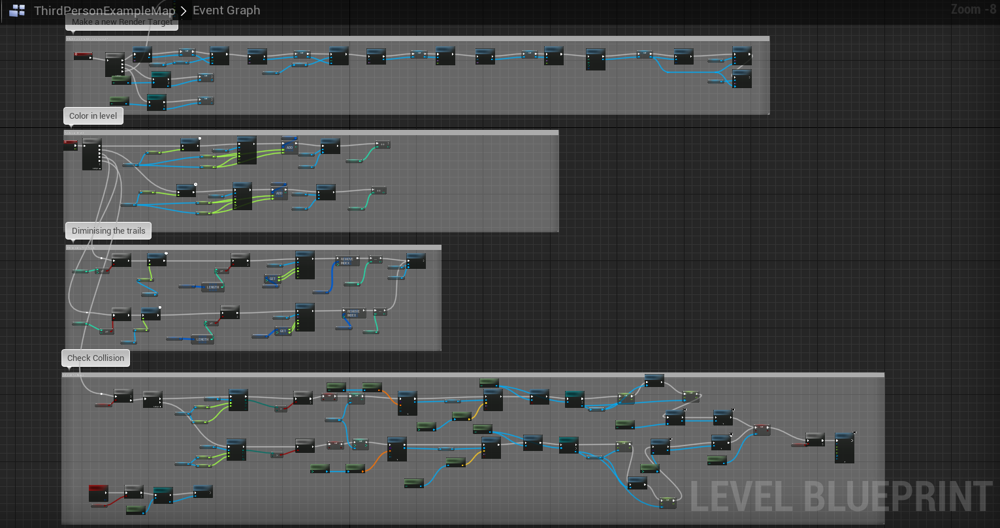

# SnailBlazer
It is fast paced mutli-player game with a gameplay similar to Tron races. The player plays as a snail in an enclosure and they can go over walls.
> Objective: Cut the other snail's trial and make them lose their footing

## My Work:
- Created a trail system using dynamic vertex painting.
- Linked trail collision system with win and fail states
- Added a system to reset the vertex colors after a timer as the snail moves
- Lighting and other in-game shaders

## ScreenShots:

## Gameplay Video:
[Gameplay](./Media/Snail Blazer TechDemo.mp4)